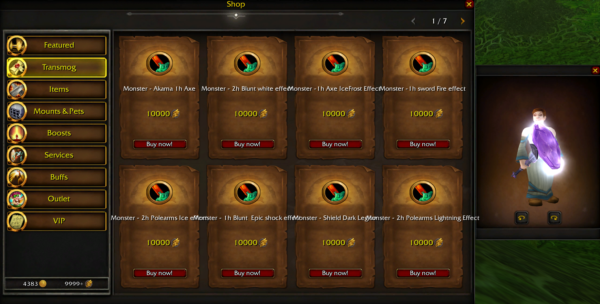

# InGameShop-335a

**Lua Script Shop for WOTLK 3.3.5a**

Im looking for someone who can make it work with FusionGEN database structure please !
Unique and working store is perfect for your server AzerothCore, TrinityCore, and Mangos for 3.3.5a.
It works on Eluna written in Lua and uses the AIO module which can be downloaded from this [link](https://github.com/Rochet2/AIO).

**Installation:**

1. Put contents of "Client" in a patch using "Ladik's MPQ Editor"
or simply create "New Folder" named patch-x.mpq in Your WOW Directory..

2. Put contents of "Server" in the Lua scripts directory on the server.
3. Run contents of "SQL" in MySQL in a database named "store".
4. You can access the store through the "Escape" menu in-game.

**DB flags and other config specific stuff:**

Some dummy data is already provided with the database. All data in the database can be safely removed and configured to your liking. The store frame PSD contains some guide borders to show the area of a texture being selected. This should allow you to customize as you please without really touching any of the code. Area is always the top-left black border pixel to the bottom-right black pixel. Stay within this border and you're fine. All scripts have some config options at the top of the script. Review these if need be.

**store_categories:**

- `icon`: sets the navigation button icon to the one specified, this checks in the "interface/icons" directory.
- `requiredRank`: This defines the minimum account rank needed to open a category.
- `flags = 1`: This flags a category as a "Sales" category. It will automatically populate with all items that are on sale.
- `flags = 2`: This flags a category as a "New" category. It will automatically populate with all items that are flagged as new.
- `enabled`: set this to 0 to disable a category. it will not be rendered in the navigation list.

**store_services:**

- `type = 1`: items, will award everything in reward_1 to reward_8 through mail.
- `flags = 1`: will enable the preview pane when the service box is clicked. will preview all items from reward_1 to reward_8.
- `type = 2`: gold.

